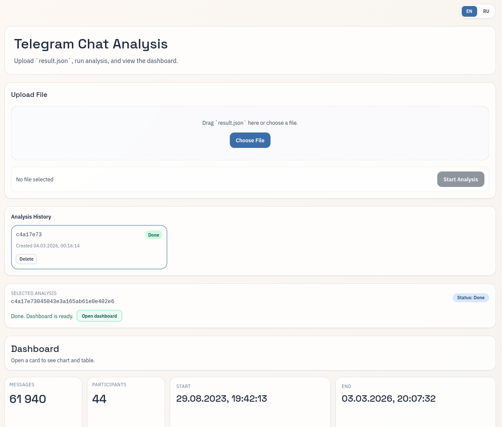
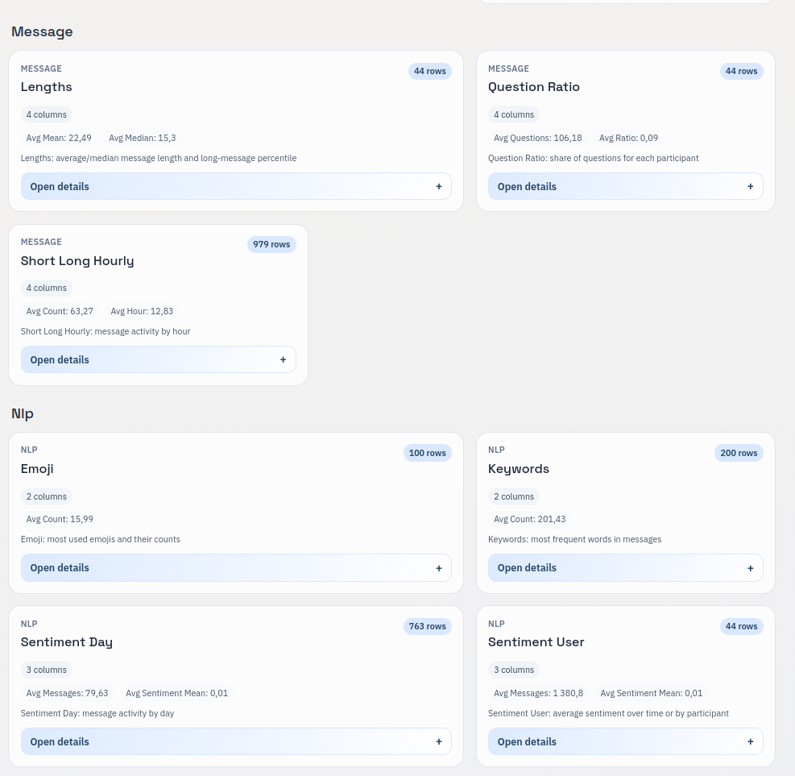
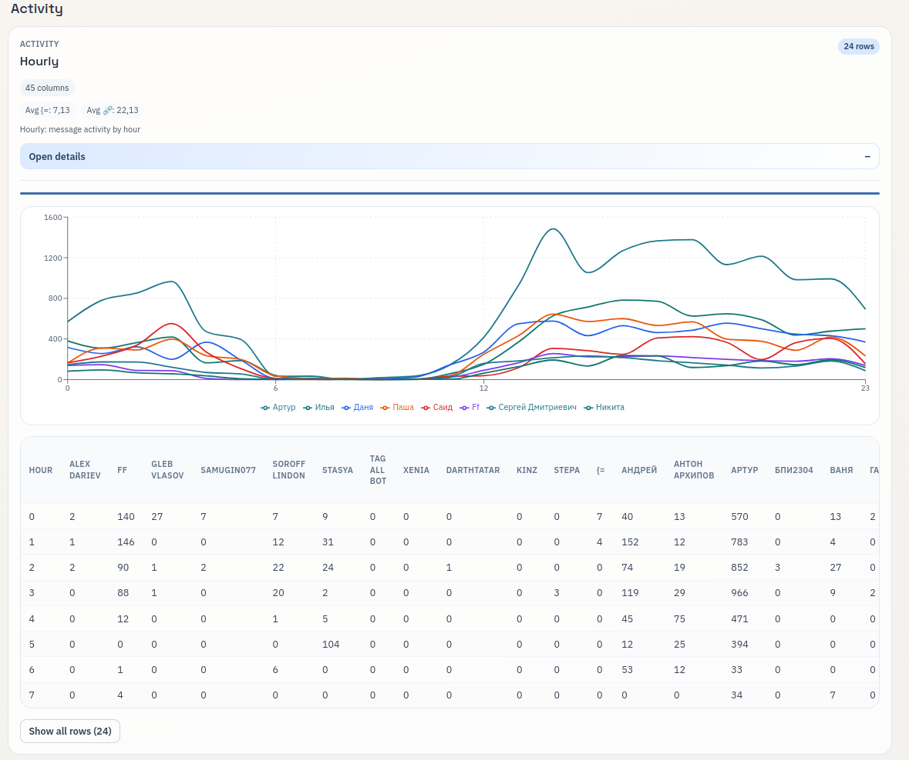

# Chat Analyzer

Chat Analyzer is a self-hosted tool that converts Telegram Desktop JSON exports into interactive analytics dashboards.

## Why Use It

- Upload Telegram JSON exports and run async analysis.
- Explore metrics through charts, KPI cards, and tables.
- Run locally with Docker or deploy with prebuilt GHCR images.
- Keep full control of data in your own environment.

## Screenshots





## Quick Start

```bash
docker compose -f docker-compose.prod.yml up -d
```

Open:

- Web UI: `http://localhost:8080`
- API docs: `http://localhost:8080/docs`

## Documentation

Start here: [docs/README.md](docs/README.md)

User docs:

- [docs/getting-started.en.md](docs/getting-started.en.md)
- [docs/getting-started.ru.md](docs/getting-started.ru.md)
- [docs/user-guide.en.md](docs/user-guide.en.md)
- [docs/user-guide.ru.md](docs/user-guide.ru.md)
- [docs/configuration.en.md](docs/configuration.en.md)
- [docs/configuration.ru.md](docs/configuration.ru.md)

Operations and engineering:

- [docs/operations.en.md](docs/operations.en.md)
- [CONTRIBUTING.md](CONTRIBUTING.md)
- [docs/architecture.en.md](docs/architecture.en.md)
- [CHANGELOG.md](CHANGELOG.md)

## Open Source Project Files

- [LICENSE](LICENSE)
- [SECURITY.md](SECURITY.md)
- [CODE_OF_CONDUCT.md](CODE_OF_CONDUCT.md)
